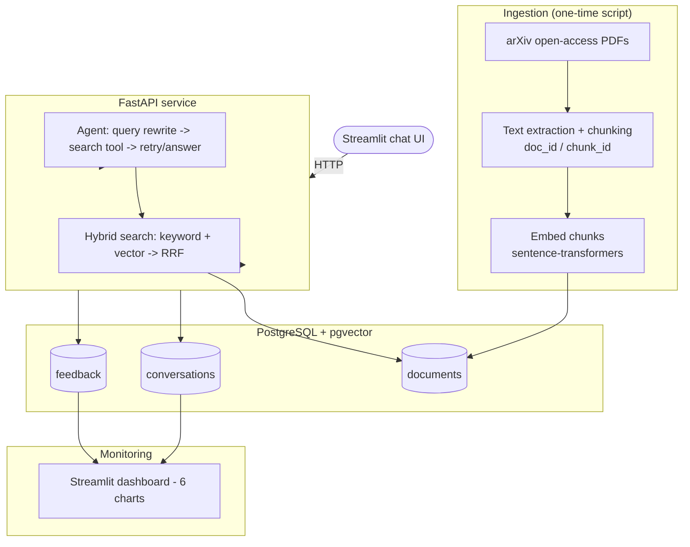

# GeoIntel AI

A RAG assistant with a lightweight search agent for remote sensing and precision-agriculture research papers.

Built for the DataTalks.Club **LLM Zoomcamp** final project.

## Problem Description

GIS practitioners, agronomists, and remote sensing students need to search and question a large corpus of
technical literature (satellite/UAV crop monitoring, land-cover classification, vegetation indices, etc.)
without reading full papers end to end. **GeoIntel AI** answers natural-language questions with grounded,
cited answers pulled from a corpus of open-access remote sensing / precision-agriculture papers from arXiv.

Example questions it's designed to answer:
- "What accuracy did recent CNN-based crop classification methods achieve?"
- "How is UAV multispectral imagery used for irrigation management?"
- "What are common approaches to land-cover classification from satellite imagery?"

## Architecture



One Postgres instance (with the `pgvector` extension) serves as both the document/vector store and the
monitoring store, to keep the stack to a single database service.

## Retrieval & Evaluation

Three retrieval methods are implemented and compared on the same LLM-generated ground truth set:

| Method | How |
|---|---|
| Keyword | `minsearch` (TF-IDF), in-memory, rebuilt from Postgres at startup |
| Vector | `pgvector` cosine similarity (`sentence-transformers/all-MiniLM-L6-v2` embeddings) |
| Hybrid | Reciprocal Rank Fusion (RRF) of the two rankings above |

Run `python -m evaluation.evaluate_search` after ingesting real data to reproduce the Hit Rate / MRR
comparison table and confirm which method performs best on your corpus.

RAG answer quality is evaluated separately with an LLM-as-judge (`python -m evaluation.evaluate_rag`),
rating each answer RELEVANT / PARTLY_RELEVANT / NON_RELEVANT with a short explanation.

## Best Practices Implemented

- **Hybrid search**: `core/search.py::hybrid_search` (RRF fusion, evaluated in `evaluate_search.py`)
- **Reranking**: RRF itself is the reranking step - result order is determined by fused rank, not raw
  similarity from either method alone
- **Query rewriting**: `core/agent.py::rewrite_query` - a standalone LLM call that cleans up the raw
  question into a search-friendly query before retrieval; the agent can additionally reformulate and
  retry mid-conversation if results look off (see "Agent" below)

## Agent

`core/agent.py::run_agent` is a hand-rolled function-calling loop (no agent framework) with a single tool,
`search_papers`. The model can call it, inspect results, and retry with a different query (capped at 4
iterations) before producing a final answer - this is what lets it recover from a vague or mistyped
question instead of just returning a bad answer from a bad first search.

## Tech Stack

| Layer | Tool |
|---|---|
| LLM | [Vercel AI Gateway](https://vercel.com/docs/ai-gateway) (OpenAI SDK, provider-agnostic - change `LLM_MODEL` in `.env` to switch providers) |
| Embeddings | `sentence-transformers` (`all-MiniLM-L6-v2`) |
| Keyword search | `minsearch` |
| Vector search | PostgreSQL + `pgvector` |
| Agent | Hand-rolled function-calling loop |
| API | FastAPI |
| UI | Streamlit (thin HTTP client over the API) |
| Monitoring | Postgres + Streamlit dashboard (Plotly charts) |
| Containerization | Docker + Docker Compose |

## Project Structure

```
geointel-ai/
├── core/            # chunking, embedding, search, RAG, agent, config, LLM client
├── ingestion/        # fetch_papers.py (arXiv), chunk_and_ingest.py
├── evaluation/       # metrics.py, generate_ground_truth.py, evaluate_search.py, evaluate_rag.py
├── api/              # FastAPI app (main.py)
├── ui/                # Streamlit chat client
├── monitoring/        # db_init.py, db_save.py, judge.py, dashboard.py
├── tests/             # pytest suite (offline + DB integration tests)
├── data/sample/        # 2 tiny synthetic papers for a fast smoke test (no internet needed)
├── Dockerfile
├── docker-compose.yaml
└── requirements.txt
```

## Setup

### Prerequisites
- Python 3.11+ and `pip`, or [`uv`](https://docs.astral.sh/uv/)
- Docker + Docker Compose (for the full containerized stack)
- A [Vercel AI Gateway](https://vercel.com/) API key

### 1. Configure environment

```bash
cp .env.example .env
# edit .env: set AI_GATEWAY_API_KEY
```

### 2. Run everything with Docker Compose (recommended)

```bash
docker-compose up -d db
python -m monitoring.db_init   # run once, against the dockerized DB (localhost:5432)
docker-compose up -d
```

- API: http://localhost:8000/docs (interactive Swagger UI)
- Chat UI: http://localhost:8501
- Monitoring dashboard: http://localhost:8502

### 3. Or run locally without Docker

```bash
pip install -r requirements.txt
# Postgres must be running locally with the pgvector extension available
python -m monitoring.db_init
uvicorn api.main:app --reload --port 8000          # terminal 1
streamlit run ui/streamlit_app.py                   # terminal 2
streamlit run monitoring/dashboard.py --server.port 8502  # terminal 3
```

### 4. Ingest data

**Quick smoke test (no internet needed, ~5 seconds)** - uses the 2 tiny sample papers in `data/sample/`:
```bash
python -m ingestion.chunk_and_ingest --manifest data/sample/manifest.json --stub-embedder
```
This uses a deterministic offline stand-in for the embedding model (no semantic understanding, just
proves the pipeline works end to end). **Do not use `--stub-embedder` for real evaluation** - remove the
flag once you're ready to ingest the real corpus, so real `sentence-transformers` embeddings are used.

**Real corpus:**
```bash
python -m ingestion.fetch_papers --max-results 80    # downloads real arXiv PDFs
python -m ingestion.chunk_and_ingest                  # chunks + embeds + stores them
```

### 5. Generate ground truth and evaluate

```bash
python -m evaluation.generate_ground_truth --sample 200
python -m evaluation.evaluate_search
python -m evaluation.evaluate_rag --sample 50
```

## Usage

```bash
curl -X POST http://localhost:8000/ask \
  -H "Content-Type: application/json" \
  -d '{"question": "How is UAV imagery used for crop monitoring?", "use_agent": true}'

curl -X POST http://localhost:8000/feedback \
  -H "Content-Type: application/json" \
  -d '{"conversation_id": 1, "rating": 1}'
```

Or just open http://localhost:8501 and chat.

## Testing

```bash
pip install pytest
pytest tests/                    # offline tests only will run if no DB is up
docker-compose up -d db && python -m monitoring.db_init
pytest tests/ -v                 # DB integration tests included
```

17 tests, covering chunking, metrics (Hit Rate/MRR), the offline embedder stub, the arXiv feed parser,
and DB-backed keyword/vector/hybrid search.

## Evaluation Criteria Mapping

| Criterion | Where |
|---|---|
| Problem description | This README, above |
| Retrieval flow | `core/search.py`, `core/rag.py` |
| Retrieval evaluation | `evaluation/evaluate_search.py` (Hit Rate/MRR, 3 methods compared) |
| LLM evaluation | `evaluation/evaluate_rag.py` (LLM-as-judge) |
| Interface | `api/main.py` (FastAPI) + `ui/streamlit_app.py` (Streamlit) |
| Ingestion pipeline | `ingestion/fetch_papers.py` + `ingestion/chunk_and_ingest.py` |
| Monitoring | `monitoring/dashboard.py` (6 charts) + user/judge feedback in `monitoring/db_save.py`, `monitoring/judge.py` |
| Containerization | `Dockerfile`, `docker-compose.yaml` |
| Reproducibility | `requirements.txt` with pinned minimum versions, this README |
| Hybrid search | `core/search.py::hybrid_search` |
| Reranking | RRF fusion in `core/search.py::_rrf_merge` |
| Query rewriting | `core/agent.py::rewrite_query` |

## Future Improvements

- Automated ingestion via Kestra/Airflow/Prefect (currently a semi-automated script)
- Grafana dashboard as an alternative/addition to the Streamlit one
- Formal agent-trajectory evaluation (currently: trajectory logging + manual spot checks)
- Cloud deployment
