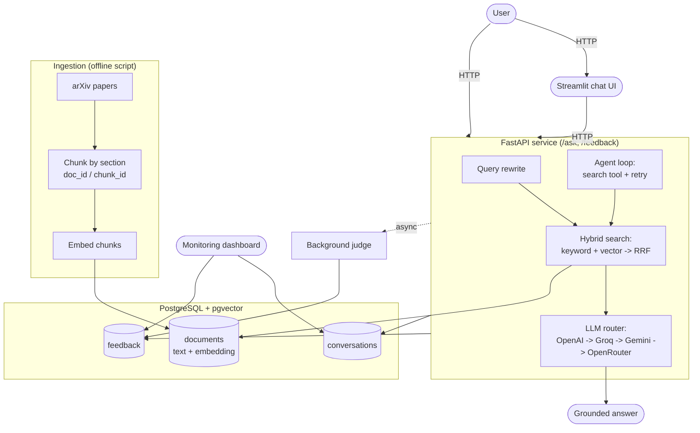

<div align="center">

# 🛰️ GeoIntel AI

**A RAG assistant with agentic search over remote sensing & precision-agriculture research papers**

*Built for the [DataTalks.Club LLM Zoomcamp](https://github.com/DataTalksClub/llm-zoomcamp) final project*


</div>

---

## Problem Description

GIS practitioners, agronomists, and remote sensing students need to search and question a large corpus of
technical literature — satellite/UAV crop monitoring, land-cover classification, vegetation indices, and
related precision-agriculture research — without reading full papers end to end.

**GeoIntel AI** answers natural-language questions with grounded, source-cited answers pulled from a corpus
of open-access remote sensing / precision-agriculture papers sourced from arXiv. Retrieval combines keyword
and vector search; a lightweight agent can rewrite and retry the search when the first attempt comes back
weak, instead of just returning a bad answer from a bad first search.

Example questions it's built to answer:
- *"What accuracy did recent CNN-based crop classification methods achieve?"*
- *"How is UAV multispectral imagery used for irrigation management?"*
- *"What approaches are used for land-cover classification from satellite imagery?"*

---

## Features

| Feature | Description |
|---|---|
| **Hybrid retrieval** | Keyword search (minsearch) + vector search (pgvector) fused with Reciprocal Rank Fusion |
| **Agentic search** | A hand-rolled tool-calling loop that can reformulate and retry a search before answering |
| **Query rewriting** | A standalone LLM step that cleans up the raw question into a search-friendly query |
| **Multi-provider LLM router** | Every LLM call automatically falls back across OpenAI (via Vercel AI Gateway) → Groq → Gemini → OpenRouter |
| **Retrieval evaluation** | Hit Rate and MRR compared across keyword-only, vector-only, and hybrid search |
| **LLM evaluation** | LLM-as-a-judge rates every answer RELEVANT / PARTLY_RELEVANT / NON_RELEVANT |
| **Monitoring** | Every conversation logged to Postgres; a 6-chart Streamlit dashboard tracks cost, latency, tokens, model usage, and relevance |
| **Feedback** | User thumbs up/down + an automatic background judge, both stored and shown on the dashboard |
| **Two interfaces** | A FastAPI service (`/ask`, `/feedback`) and a thin Streamlit chat client on top of it |
| **Containerized** | Full stack (DB, API, chat UI, dashboard) runs with a single `docker compose up` |

---

## Architecture



**Request flow:** a question comes in → (optionally) gets rewritten into a cleaner search query →
hybrid search retrieves candidate chunks → the LLM router calls the first available provider/model to
generate a grounded answer → the conversation is logged → a background task asks a judge model to rate
the answer's relevance, without adding latency to the response the user sees.

---

## Project Structure

```
geointel-ai/
├── core/
│   ├── config.py          # all environment-driven configuration in one place
│   ├── llm_client.py       # multi-provider LLM router (OpenAI/Groq/Gemini/OpenRouter fallback)
│   ├── chunking.py         # section-aware PDF chunking (doc_id / chunk_id)
│   ├── embedder.py         # sentence-transformers embedder (+ offline test stub)
│   ├── search.py           # keyword, vector, and hybrid (RRF) search
│   ├── rag.py               # search -> prompt -> LLM
│   └── agent.py             # query rewrite + tool-calling agent loop
├── ingestion/
│   ├── fetch_papers.py      # downloads open-access papers from the arXiv API
│   └── chunk_and_ingest.py   # chunks + embeds + stores papers in Postgres
├── evaluation/
│   ├── metrics.py                  # Hit Rate / MRR (pure functions)
│   ├── generate_ground_truth.py    # LLM-generated (question, chunk_id) pairs
│   ├── evaluate_search.py          # compares keyword vs vector vs hybrid
│   └── evaluate_rag.py             # LLM-as-judge evaluation of full answers
├── api/
│   └── main.py               # FastAPI app: /ask, /feedback, /health
├── ui/
│   └── streamlit_app.py       # thin chat client calling the API over HTTP
├── monitoring/
│   ├── db_init.py             # schema: documents, conversations, feedback
│   ├── db_save.py             # logs conversations + feedback, estimates cost
│   ├── judge.py                # background relevance judge
│   └── dashboard.py            # 6-chart Streamlit monitoring dashboard
├── tests/                      # pytest suite (offline unit tests + DB integration tests)
├── data/sample/                 # 2 tiny synthetic papers for a fast, offline smoke test
├── Dockerfile
├── docker-compose.yaml
└── requirements.txt
```

---

## Tech Stack

| Layer | Tool |
|---|---|
| LLM access | OpenAI SDK, routed through [Vercel AI Gateway](https://vercel.com/docs/ai-gateway) / Groq / Gemini / OpenRouter |
| Embeddings | `sentence-transformers` (`all-MiniLM-L6-v2`, 384-dim) |
| Keyword search | `minsearch` |
| Vector search | PostgreSQL + `pgvector` |
| Database driver | `psycopg` 3 |
| API | FastAPI |
| UI | Streamlit |
| Monitoring charts | Plotly |
| Validation / structured output | Pydantic |
| Containerization | Docker + Docker Compose |
| PDF parsing | PyMuPDF |

---

## How Hybrid Search Works

Three retrieval methods are implemented in `core/search.py`:

1. **Keyword search** — a `minsearch` TF-IDF index, held in memory and rebuilt from Postgres at process
   startup (the corpus is small enough that this takes seconds).
2. **Vector search** — cosine similarity against `pgvector`, computed directly in Postgres
   (`embedding <=> query_vector`).
3. **Hybrid search** — both methods run independently, and their rankings are merged with
   **Reciprocal Rank Fusion (RRF)**: each result's score is `sum(1 / (k + rank + 1))` across every ranked
   list it appears in (`k = 60`). This is also this project's **reranking** technique — RRF re-orders
   results by fused rank rather than by either method's raw score alone.

`evaluation/evaluate_search.py` runs all three methods against the same ground-truth question set and
reports Hit Rate and MRR side by side, so the best-performing method is chosen with evidence rather than
assumed.

---

## How the Agent Works

`core/agent.py` implements a hand-rolled function-calling loop (no agent framework) with a single tool:

```json
{
  "name": "search_papers",
  "description": "Search the paper corpus for chunks relevant to a query. Call again with a reformulated query if results look irrelevant or empty.",
  "parameters": { "query": "string" }
}
```

The loop (`run_agent`):
1. Sends the question (and the `search_papers` tool) to the LLM router.
2. If the model calls the tool, runs `search_papers` against hybrid search, feeds the results back, and
   lets the model decide whether to answer or call the tool again with a different query (capped at
   `MAX_ITERATIONS = 4` to prevent runaway loops).
3. Once the model responds without a tool call, that's the final answer.
4. Every tool call is logged into a `trajectory` list — the sequence of queries tried is inspectable, not
   just the final answer.

Separately, `rewrite_query()` is a standalone LLM call that turns the user's raw question into a
keyword-focused search query **before** the first search — independent of the agent's own retry behavior,
so query rewriting is demonstrable on its own.

---

## LLM Router

Every LLM call in this project goes through one wrapper, `core/llm_client.py`, instead of calling a
provider's SDK directly. It tries a list of `provider/model` strings in order and automatically falls
through to the next one if a call fails with a rate limit, timeout, authentication error, or a general API
error:

```
openai/gpt-5.4-mini  →  groq/llama-3.3-70b-versatile  →  google/gemini-2.5-flash  →  openrouter/...
```

- **`openai/...`** is routed through the Vercel AI Gateway (`AI_GATEWAY_API_KEY`).
- **`groq/...`**, **`google/...`**, **`openrouter/...`** are called directly against each provider's
  OpenAI-compatible endpoint (`GROQ_API_KEY`, `GEMINI_API_KEY`, `OPENROUTER_API_KEY`).

Three separate fallback chains are configurable independently — `RAG_MODELS`, `AGENT_MODELS`,
`JUDGE_MODELS` — since, in practice, the judge step doesn't need the same model quality as the main answer.
Switching or reordering providers is a `.env` change only; no code changes are needed.

> **Known limitation:** structured-output parsing (used by the ground-truth generator and both judges)
> relies on the target provider correctly honoring the requested JSON schema. In testing, this worked
> reliably on OpenAI-family models; a third-party model reached via fallback occasionally returned a
> differently-shaped object, which raised a Pydantic validation error. This is caught and logged rather
> than crashing the request (see `monitoring/judge.py`), but if the judge step feels unreliable, put an
> OpenAI-family model first in `JUDGE_MODELS`.

---

## Monitoring

Every `/ask` call is logged to a `conversations` table (question, answer, model, retrieved chunk ids,
whether the agent was used, tool call count, token counts, an estimated cost, response time). Two feedback
channels write to a `feedback` table:

- **User feedback** — thumbs up/down from the chat UI, via `POST /feedback`.
- **Judge feedback** — a background task (`monitoring/judge.py`) rates every answer's relevance
  automatically, after the response has already been sent to the user (no added latency).

`monitoring/dashboard.py` (Streamlit) reads both tables and renders 6 charts: cost over time, response
time over time, token usage per conversation, model usage, judge relevance distribution, and user
thumbs up/down counts, plus a table of recent conversations.

---

## Evaluation

**Search evaluation** (`evaluation/evaluate_search.py`) — Hit Rate and MRR (`evaluation/metrics.py`) are
computed for keyword-only, vector-only, and hybrid search against the same ground-truth set, so the best
method is picked with evidence.

**Ground truth generation** (`evaluation/generate_ground_truth.py`) — for a sample of chunks, an LLM
generates several realistic questions each chunk would answer (structured Pydantic output), producing
`(question, chunk_id)` pairs.

**RAG evaluation** (`evaluation/evaluate_rag.py`) — runs the actual RAG pipeline on ground-truth questions,
then asks a judge model to rate each answer `RELEVANT` / `PARTLY_RELEVANT` / `NON_RELEVANT` with a short
explanation (the same rating scheme the online judge uses).

---

## Installation

### Prerequisites
- Python 3.11+
- Docker + Docker Compose (for the full containerized stack)
- At least one LLM provider API key (Vercel AI Gateway, Groq, Gemini, and/or OpenRouter)

```bash
git clone <this-repo>
cd geointel-ai
cp .env.example .env   # fill in your API key(s) - see Environment Variables below
```

---

## Environment Variables

| Variable | Required | Description |
|---|---|---|
| `AI_GATEWAY_API_KEY` | if using `openai/...` models | Vercel AI Gateway key |
| `GROQ_API_KEY` | if using `groq/...` models | Groq API key |
| `GEMINI_API_KEY` | if using `google/...` models | Google Gemini API key |
| `OPENROUTER_API_KEY` | if using `openrouter/...` models | OpenRouter API key |
| `RAG_MODELS` | no (has a default) | Comma-separated fallback chain for answer generation |
| `AGENT_MODELS` | no (has a default) | Comma-separated fallback chain for the agent loop |
| `JUDGE_MODELS` | no (has a default) | Comma-separated fallback chain for relevance judging |
| `LLM_MODEL` | no (has a default) | Single fallback model reference, used for cost estimation |
| `POSTGRES_HOST` / `POSTGRES_PORT` / `POSTGRES_DB` / `POSTGRES_USER` / `POSTGRES_PASSWORD` | yes | Database connection |
| `POSTGRES_SSLMODE` | no (defaults to `prefer`) | Set to `require` for hosted Postgres providers (e.g. Neon) that mandate TLS |
| `EMBEDDING_MODEL` | no (has a default) | sentence-transformers model name |
| `EMBEDDING_DIM` | no (has a default) | Must match the embedding model's output dimension |
| `API_PORT` | no (has a default) | FastAPI port |

You only need API keys for the providers you actually list in `RAG_MODELS` / `AGENT_MODELS` /
`JUDGE_MODELS` — a provider with no key configured simply fails and the router moves to the next one.

---

## Running Locally

```bash
pip install -r requirements.txt

# Postgres with pgvector must be reachable (Docker, local install, or a hosted provider like Neon)
python -m monitoring.db_init

# Quick offline smoke test (no internet, no real API needed for ingestion):
python -m ingestion.chunk_and_ingest --manifest data/sample/manifest.json --stub-embedder

# Start the API
python -m uvicorn api.main:app --reload --port 8000

# In separate terminals:
python -m streamlit run ui/streamlit_app.py
python -m streamlit run monitoring/dashboard.py -- --server.port 8502
```

For the real corpus (requires internet access to arXiv and a real embedding model download):
```bash
python -m ingestion.fetch_papers --max-results 80
python -m ingestion.chunk_and_ingest
```

---

## Docker Setup

```bash
docker compose up -d db
python -m monitoring.db_init      # against the dockerized DB on localhost:5432
docker compose up -d
```

| Service | URL |
|---|---|
| API (Swagger UI) | http://localhost:8000/docs |
| Chat UI | http://localhost:8501 |
| Monitoring dashboard | http://localhost:8502 |

---

## Deployment

> The application is not currently deployed to the cloud. The steps below are a **deployment guide**,
> not a description of existing infrastructure.

**Backend (FastAPI + Postgres):** any container-friendly Python host works — for example
[Railway](https://railway.app), [Render](https://render.com), or [Fly.io](https://fly.io). In general:
1. Provision a managed Postgres instance with the `pgvector` extension (or use a host's own Postgres
   add-on, or an external provider like Neon).
2. Deploy the `api` service from the existing `Dockerfile`, setting the environment variables listed
   above (LLM provider keys, `POSTGRES_*`, model fallback chains).
3. Run `python -m monitoring.db_init` once against the deployed database.

**Frontend (Streamlit chat UI / dashboard):** can be deployed separately (e.g. to
[Streamlit Community Cloud](https://streamlit.io/cloud) or as its own container), pointed at the deployed
API via the `API_URL` environment variable.

Make sure the deployed frontend's `API_URL` and the backend's CORS/network settings allow the two services
to reach each other.

---

## API Endpoints

### `POST /ask`
```json
{
  "question": "How is UAV imagery used for crop monitoring?",
  "use_agent": true,
  "rewrite": true
}
```
`use_agent` toggles the agent loop vs. a plain search-then-answer call; `rewrite` (only used when
`use_agent` is `false`) toggles the standalone query-rewrite step.

Response:
```json
{
  "conversation_id": 42,
  "question": "How is UAV imagery used for crop monitoring?",
  "rewritten_query": null,
  "answer": "...",
  "retrieved_chunk_ids": ["2401.01234_003", "2401.01234_004"],
  "used_agent": true,
  "tool_calls": 1,
  "response_time_ms": 1840
}
```

### `POST /feedback`
```json
{ "conversation_id": 42, "rating": 1 }
```
`rating` is `1` (thumbs up) or `-1` (thumbs down).

### `GET /health`
```json
{ "status": "ok", "chunks_indexed": 3587 }
```

### Sample requests

```bash
curl -X POST http://localhost:8000/ask \
  -H "Content-Type: application/json" \
  -d '{"question": "How is UAV imagery used for crop monitoring?", "use_agent": true}'

curl -X POST http://localhost:8000/feedback \
  -H "Content-Type: application/json" \
  -d '{"conversation_id": 1, "rating": 1}'
```

---

## Testing

```bash
pip install pytest
pytest tests/                      # offline tests only, if no DB is running
docker compose up -d db && python -m monitoring.db_init
pytest tests/ -v                   # includes DB-backed integration tests
```

17 tests covering: section-aware chunking, Hit Rate / MRR against hand-computed values, the offline
embedder stub, the arXiv Atom feed parser, and DB-backed keyword / vector / hybrid search.

---

## Evaluation Commands

```bash
python -m evaluation.generate_ground_truth --sample 200
python -m evaluation.evaluate_search
python -m evaluation.evaluate_rag --sample 50
```

---


## Screenshots
docs/screenshots

<!--(docs/screenshots/) -->

---

## LLM Zoomcamp Evaluation Mapping

<details>
<summary><b>Click to expand the full rubric mapping</b></summary>

| Criterion | Where it's implemented |
|---|---|
| Problem description | This README, "Problem Description" |
| Retrieval flow | `core/search.py`, `core/rag.py` — knowledge base + LLM both used |
| Retrieval evaluation | `evaluation/evaluate_search.py` — 3 methods compared (Hit Rate / MRR), best one used |
| LLM evaluation | `evaluation/evaluate_rag.py` — LLM-as-judge over ground-truth questions |
| Interface | `api/main.py` (FastAPI) + `ui/streamlit_app.py` (Streamlit) |
| Ingestion pipeline | `ingestion/fetch_papers.py` + `ingestion/chunk_and_ingest.py` (semi-automated script) |
| Monitoring | `monitoring/dashboard.py` (6 charts) + user & judge feedback (`monitoring/db_save.py`, `monitoring/judge.py`) |
| Containerization | `Dockerfile`, `docker-compose.yaml` — full stack in Compose |
| Reproducibility | `requirements.txt` with pinned minimum versions, this README |
| Hybrid search | `core/search.py::hybrid_search` |
| Document reranking | RRF fusion, `core/search.py::_rrf_merge` |
| Query rewriting | `core/agent.py::rewrite_query` |
| Agent | `core/agent.py::run_agent` — hand-rolled function-calling loop with retry |
| Multi-provider LLM routing | `core/llm_client.py` — automatic fallback across 4 providers |

</details>

---

## Future Improvements

- Automated ingestion orchestration (Kestra / Airflow / Prefect) instead of a semi-automated script
- A Grafana dashboard as an alternative/addition to the Streamlit one
- Formal automated agent-trajectory evaluation (currently: trajectory logging + manual inspection)
- Actual cloud deployment (see "Deployment" above for the intended path)

---


## Acknowledgements

- [DataTalks.Club LLM Zoomcamp](https://github.com/DataTalksClub/llm-zoomcamp) for the course structure
  this project follows
- [arXiv](https://arxiv.org) for open access to the research papers used as the knowledge base
- [minsearch](https://github.com/alexeygrigorev/minsearch) for the lightweight keyword search index
